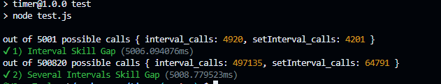

# timer
custom and more accurate setInterval and setTimeout functionality that is not nerfed for things like when the browser tab is not in focus

Roughly 99% accurate _real_ time intervals in JavaScript

