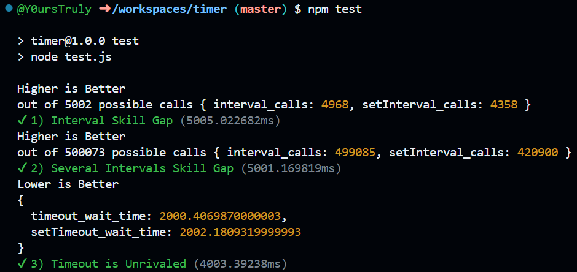

# Timer (for JavaScript)
Custom and more accurate setInterval and setTimeout functionality that is not nerfed for things like when the browser tab is not in focus

# Features
- Roughly 99% accurate _real time_ intervals in JavaScript
- Smaller footprint to the JavaScript Event Loop than main `timer.js`

# Installation
Install via:
```
npm install @y0urstruly/timer
```


# Usage
## JavaScript
- Main Timer Library
```
const {timeout,interval,wait,clear} = require('@y0urstruly/timer');
```
- Alternate Timer Library (this is the readme for the alternate)
```
const {timeout,interval,wait,clear} = require('@y0urstruly/timer/docile');
```

## TypeScript
- Main Timer Library
```
import {timeout,interval,wait,clear} = from '@y0urstruly/timer';
```
- Alternate Timer Library (this is the readme for the alternate)
```
import {timeout,interval,wait,clear} = from '@y0urstruly/timer/docile';
```


# Modules
- `interval(userFN:()=>void, ms:number): number`: better setInterval, first argument is function, second argument is ms, returns _ID_
- `timeout(userFN:()=>void, ms:number): number`: better setTimeout, first argument is function, second argument is ms, returns _ID_
- `wait(ms:number): Promise<void>`: all you python **sleep** using kids, your functionality offered by a promise wrapped around **timeout** (tldr; _await wait(ms)_)
- `clear(ID:number): boolean`: removes any **interval** or **timeout** by _ID_. For example _clear(timeout(someFN))_ is a waste of code since _someFN_ will never run

# Disclaimers
- The smallest unit of accuracy is only a whole millisecond (LESS ACCURATE THAN MAIN `timer.js`)
- Since this only checks every 1 ms, the worst case error is 0.999... ms

# Comparison to Native Modules
- This section will always be dedicated to displaying the test results of the current commit
